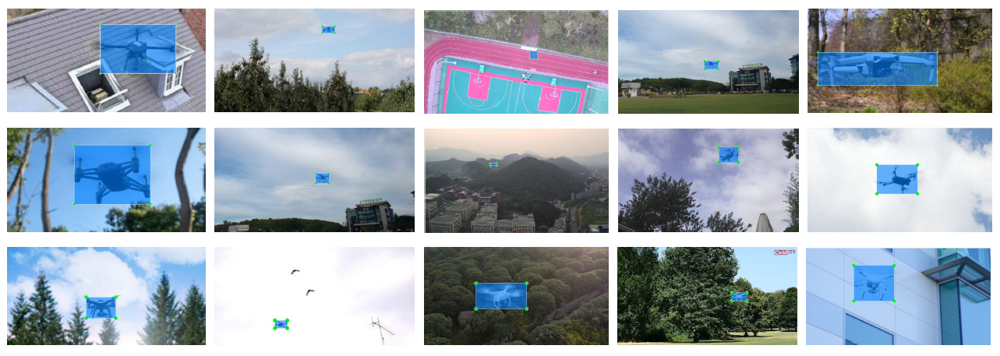

# MAVs-Dataset
The dataset is collected from three different sources, which are the online published datasets, our recorded videos, and the online images. The images include the Micro Air Vehicles (MAVs) in different environmental backgrounds. 
The dataset was used to train several deep learning models for detecting MAVs in real-time. 



# Download
The images can be downloaded using the link below:
````
https://staffusm-my.sharepoint.com/:f:/g/personal/aehannwoei_usm_my/EgZX92pEcupNsFWRNSUolCoBrkzy3GvQWiClCM_4Ca8Lfg?e=u62nRa
````

# Citation
If you use this dataset in an academic context, please cite our work:
````
The academic paper was submitted to Aerospace Science and Technology.
````


